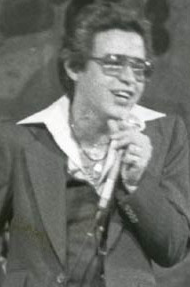

You can see important Salsa figures here:
---
## Héctor Lavoe:

[fania.com](https://fania.com/artist/hector-lavoe/)

He was born in 1946 in the city of Ponce, Puerto Rico. Lavoe was known as one of the most important Salsa performers of all time; he collaborated with Willie Colón, producing some of the most famous and acclaimed Salsa Albums such as "Lo Mato," "Vigilante," "Asalto Navideño," "La Gran Fuga." He also released albums as a solo artist, such as "De ti Depende" and "La Voz."
Lavoe had a difficult life full of substance abuse, infidelities and death. He died of HIV in 1993, but he will always be remembered as an important part of the Salsa genre.

[www.salserisimoperu.com](https://www.salserisimoperu.com/callao-hector-lavoe-monumento-cuerpo-completo-inaugurado-con-exito-salsa-noticia-16-04-2017/)

He is now considered a legend, not only in Puerto Rico but also other countries such as Peru.

### 1940s

## Rafael Ithier  

## Tito Puente  

### 1950s

## Ismael Rivera  

## Cheo Feliciano  

## Johnny Pacheco  

## Ray Barretto  

## Yomo Toro 

### 1960s

## Willie Rosario  

## Larry Harlow  

## Eddie Palmieri  

## Tommy Olivencia  

## Willie Colón  

## Hector Lavoe  

## Ismael Miranda  

### 1970s

## Ruben Blades  

## Celia Cruz  

## Oscar D'Leon  

## Joe Arroyo  

## Yolanda Rivera  

## Albita Rodriguez 

### 1980s

## Frankie Ruiz  

## Eddie Santiago  

## Lalo Rodriguez 

### 1990s

## La India  

## Gilberto Santa Rosa  

## Jerry Rivera  

## Marc Anthony  

## Victor Manuelle  

## Jairo Varela  

