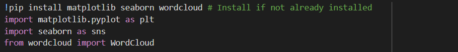
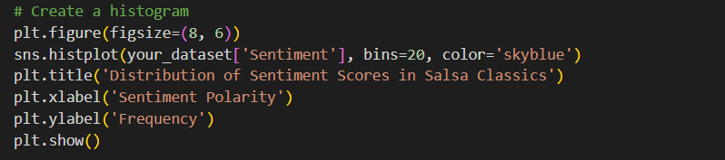
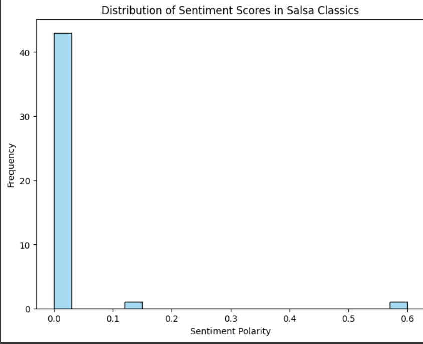
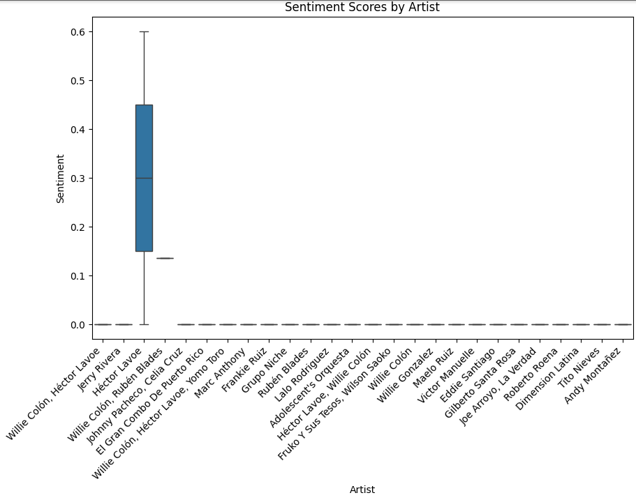
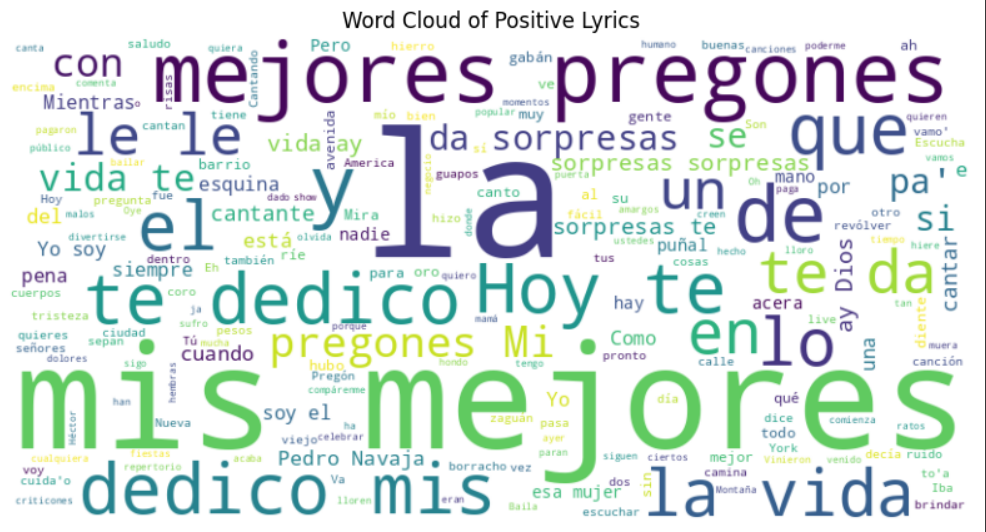

You can see a demo of an analysis here:
## Code 1

## Code 2

These are the codes I've used so far.

Take into account that this is a demo, the dataset is not complete, nor the entire analysis process, for now, the sentiment analysis seems vague and suspiciously positive; maybe the library will change over time to one that works better with Spanish, 
## Data Visualization 1

## Data Visualization 2

Data Visualization still needs to be clarified, but it will improve.
I still haven't selected stopwords but this is a demostration of the positive lyrics, the tool said that there were no negative lyrics to create on Word cloud which is of course not true but it probably needs a more specific set of rules and more lyrics and data, still this looks good.

