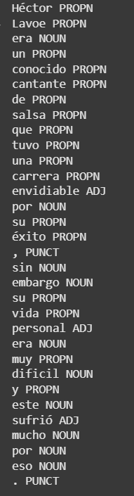
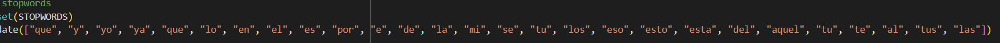
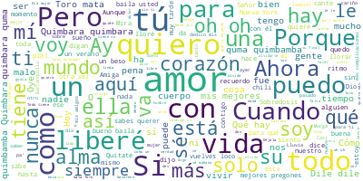
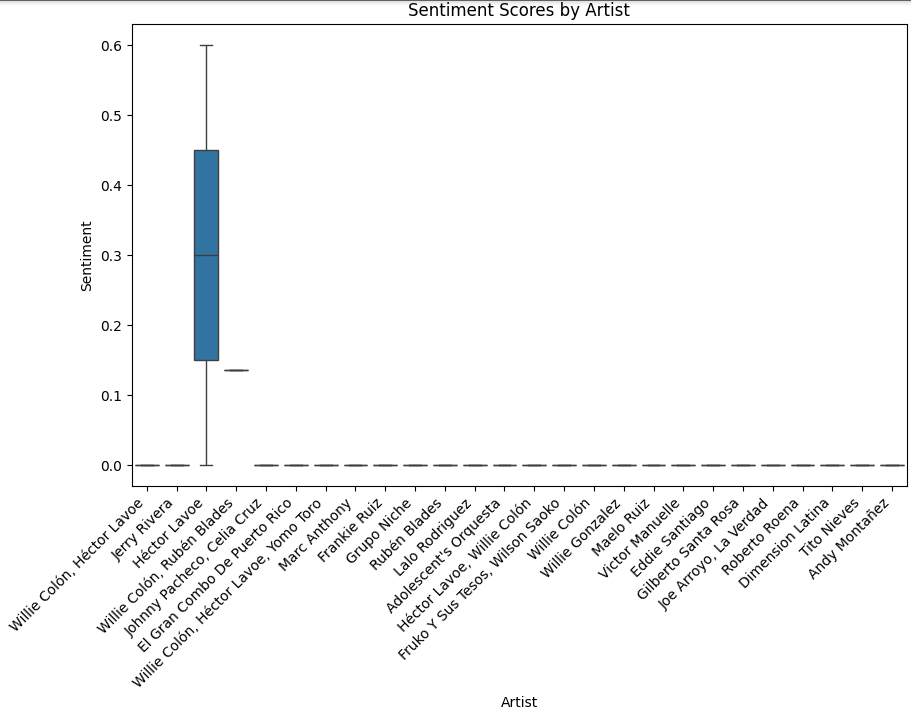
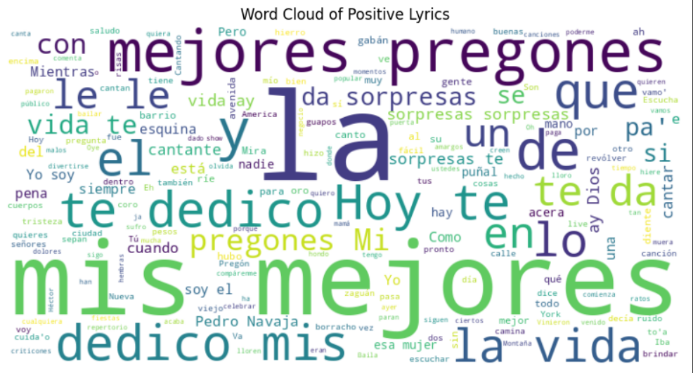

For the Analysis of the lyrics of the songs in the dataset, I needed a tool that worked efficiently with the spanish language. The tool that apparently worked is called SpaCy. This tool analizes text word by word and can categorize words into their own category such as nouns, verbes and adjectives as well as define the entity of each word, for example “Héctor Lavoe” PERS..
I used this tool to test Spanish text with a simple Spanish sentence about Salsa.

## Test Sentence.PNG

For this simple sentence, I noticed that some of the results were accurate, but others weren’t at all.

## Words test.PNG

Some words were noted as proper names when they weren’t; some were labelled as nouns when they were in reality verbs. this means that I couldn’t trust SpaCy with a pertinent analysis because it seemed to show some biases towards English and Spanish and mixed the meaning of the words of both languages.
That can be appreciated with words such as “era” which is a verb but is categorized as a noun, maybe referring to the word “era” as division of time. Another example is the word “un” which is an indefinite article but is recognized as a proper name, probably referring to the “UN” as United Nations.

I decided to create a word cloud with all the lyrics of the songs in the dataset. After a thoughtful reflection I decided to include the following stopwords:
## Stopwords.PNG

Which are words that if not excluded, appear too often and most of them are not keywords nor contribute to a pertinent word cloud about the topic of Salsa. There was a consideration to remove words such as “La-la”, “Le-le”,“Oh-oh”,“Ay” and others but some of those interjections and onomatopeic expressions are relevant for the word cloud in my opinion because those are part of the style of performance of the singers and some of them use those as a signature singing style, so I thought it would be fair to leave them on the word cloud. This decision gives specific identity to some words in the word cloud. Such as the “La-la” and “Le-le” which are for example part of Héctor Lavoe’s style of performing or other words such as “Quimbara” which have African origin and are said by Celia Cruz.

## original_wordcloud.png 

The Dataset was also analyzed on sentiment analysis. Although VADER NLTK didn’t support spanish, there is another library that supports it, called PySentimiento. With this tool I was able to sort out a percentage of positive, negative and neutral lyrics in this song.

## Overall Sentiment Bar

Data Visualization still needs to be clarified, but it will improve.
I still haven't selected stopwords but this is a demostration of the positive lyrics, the tool said that there were no negative lyrics to create on Word cloud which is of course not true but it probably needs a more specific set of rules and more lyrics and data, still this looks good.

